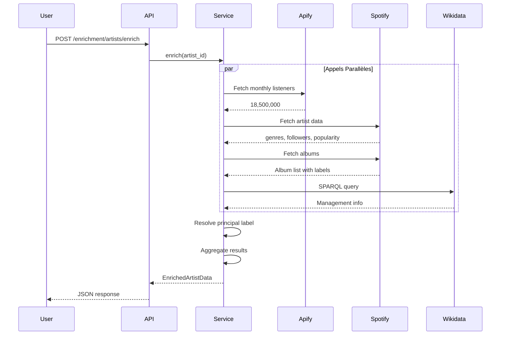
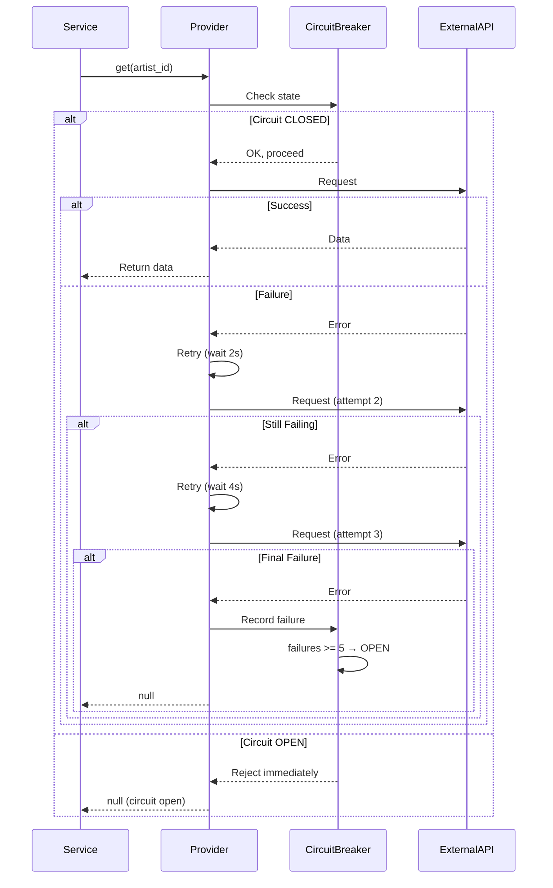
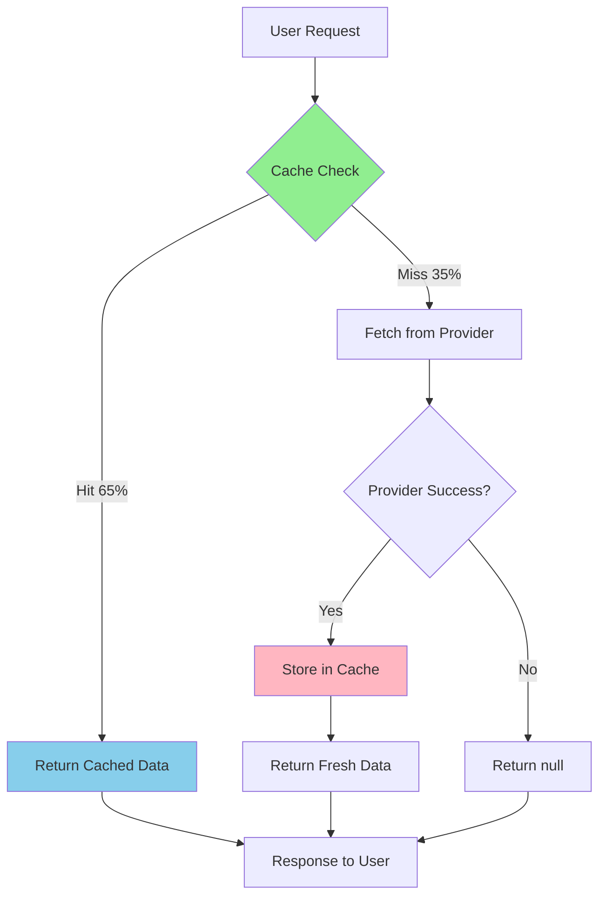
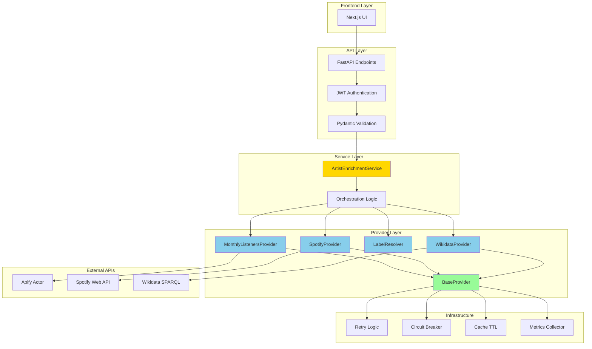
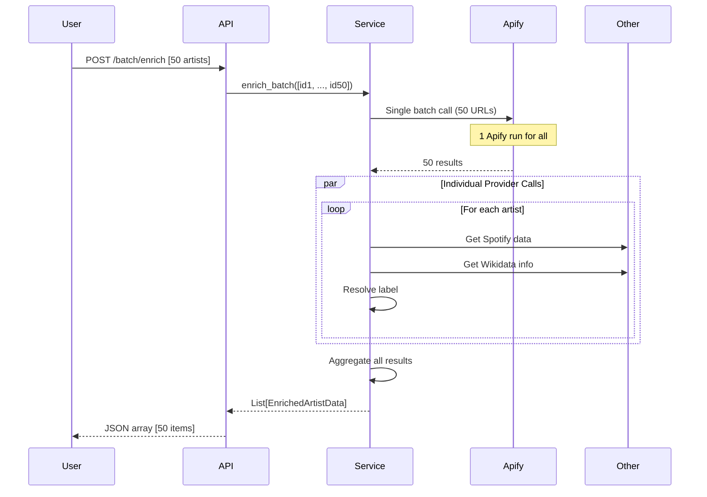
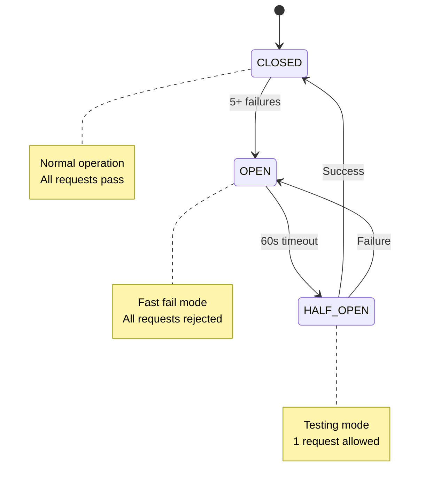
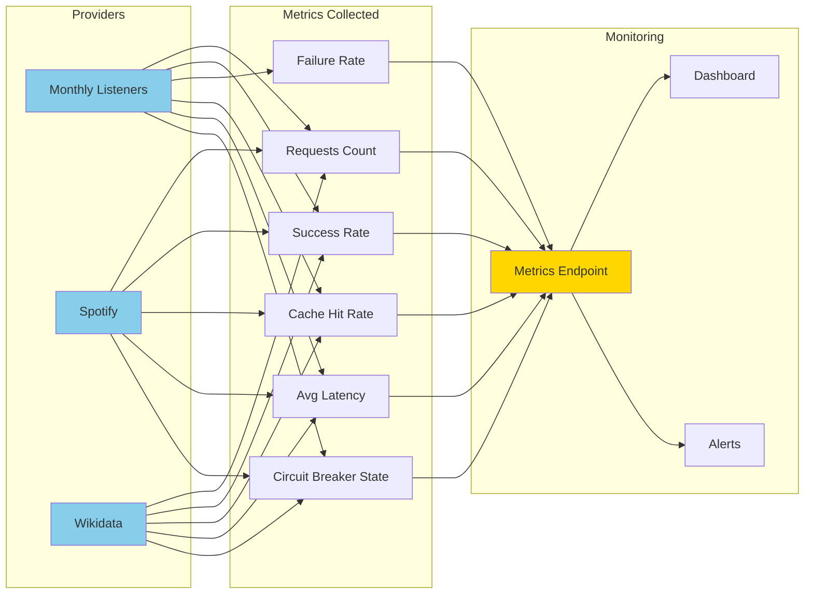
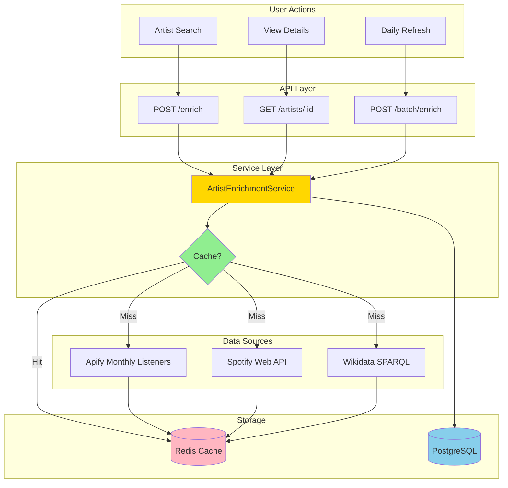
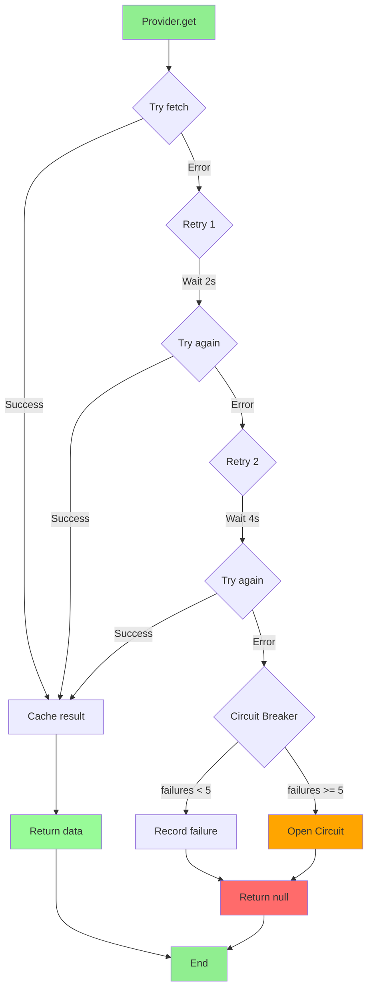

# Diagrammes Architecture - Artist Enrichment API

## Diagramme 1: Flow d'Enrichissement Simple



## Diagramme 2: Retry & Circuit Breaker



## Diagramme 3: Cache Flow



## Diagramme 4: Architecture Complète



## Diagramme 5: Batch Processing



## Diagramme 6: Circuit Breaker States



## Diagramme 7: Label Resolution Logic

```mermaid
flowchart TD
    Start[Start Label Resolution] --> Apify{Apify has labels?}
    Apify -->|Yes| UseApify[Use Apify releases]
    Apify -->|No| Spotify{Spotify albums?}
    Spotify -->|Yes| UseSpotify[Use Spotify albums]
    Spotify -->|No| NoLabel[No label available]
    
    UseApify --> Dedup[Deduplicate releases]
    UseSpotify --> Dedup
    
    Dedup --> Method{Resolution method?}
    Method -->|latest_release| Latest[Sort by date desc]
    Method -->|most_frequent| Frequent[Count frequency]
    
    Latest --> LatestLabel[principal = releases[0].label]
    Frequent --> FreqLabel[principal = most_common label]
    
    LatestLabel --> Evidence[Build evidence trail]
    FreqLabel --> Evidence
    NoLabel --> Null[principal = null]
    
    Evidence --> Return[Return LabelsData]
    Null --> Return
    
    Return --> End[End]
    
    style Start fill:#90EE90
    style Return fill:#FFB6C1
    style End fill:#90EE90
```

## Diagramme 8: Métriques & Monitoring



## Diagramme 9: Data Flow Production



## Diagramme 10: Error Handling


